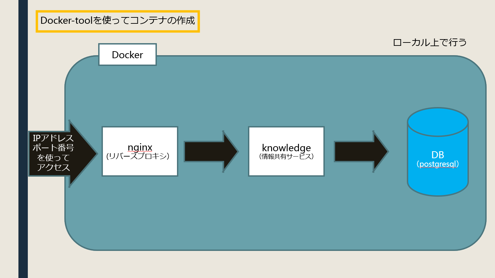

# コンテナの作成およびAWSを用いてネットワークにコンテナの整備

## したこと

自分でナレッジというサービスとデータベースにアクセスするサービスを作りました。
    できることとしては、記事を作成したらデータベースに書き込み、**ログインできるユーザみんなにその記事を見ることができる。
    ナレッジが用意している機能を使用こともでき、コメントをあげたり、いいねもできるものです。** 
さらに、ローカルで動いていたものをAWSを用いてネットワーク上に作りました。

---

### コンテナとは？
コンテナとは、イメージとしてはサーバーをすべて抽象化するものです。
そのため、**OS環境が変わっても基本ちゃんと動作できるようになります。**
作る方法は色々あるようですが、今回はDocker-toolを用いて作ろうと思います。

#### Docker-toolとは
Docker-toolとは**Dockerを作るために使うもの**です。
Dockerとはコンテナを作るアプリケーション実行環境です。
作って思ったイメージは自分のPCとは違う次元でDockerが存在しているようでした。（現にそうらしいですが）
  
dockerのイメージ図


またDockerと別にminikube(k8s)というものも存在しています。

### cygwinとは？
これは、wondowsOS上でUNIXlikeな環境にしてくれるツールです。
コマンドプロンプトみたいなものです。
基本Dockerや次回書くMinikubeもこれを用いて開発しています。

### knowledgeとは？
これは、オープンソースの情報共有サービスです。
    データベースを別で作ってそこにデータを入れることにより、自分用の情報ツールになります。
    操作も難しくなく、簡単に作成などができます。
    少し違いますが、イメージとしてはGitHubに近いと思います。
    
今回のように**コンテナを使ってとりあえずやってみるなどにとても向いているなという印象**を受けます。

### nginxとは？
これはフリーかつオープンソースなWebサーバです。（Webサーバだとはおもわなかった）
今回の用途はリーバスプロキシが主の役割です。
ほかにもロードバランサーやHTTPキャッシュなどいろいろな機能が存在しているようです。

#### リバースプロキシとは？
今回ならばdokcer-machineのIPアドレスでナレッジに接続するのではなく、先にnginxに接続することです。
どういう利点があるかというと、**負荷分散、セキュリティ**（アクセスを一括で制御できる）などあります。

### AWSとは？
アマゾンが提供しているクラウドサービスです。
すべて見てはいませんが、**サーバ**やゲームにかかわることやディープラーニングなどのサービスがあります。
借りるのにもちろんのことお金はかかります。
また、AWS以外に色々このようなサービスはあるようです。


---
# 作成手順

## １：初期設定をする。

    １：chocolateyをコマンドプロンプトでダウンロードする。
        サイトでダウンロードして環境を作ることはできるが、こっちのほうが楽（以下コマンドプロンプトでしています）

    ２：cygwinをダウンロードする。
       コマンドプロンプトでchoco install cygwin でできる。

    ３：Docker-toolboxをダウンロードする。
        同上を同じ方法でできる。
        virtualBoxが入っていないとき一緒にダウロードするかもしれないので、しっかりとダウンロードを行う。

    ４：nginxをダウンロードする
        

## ２：コンテナの作成と起動

### １：Docker-toolboxを起動する。

### ２：YMLファイルで、コンテナの名前、設定やイメージを記述する
インデントごとで解釈しているのでしっかり、インデントはそろえる。
ファイルの記述できる事は色々あるので自分で調べて記述する。
ファイル名は基本　**docker-compose** にする。（後の起動で面倒なことが起こる）
今回は、すでにナレッジとポスグレにつながっているものが参考にあげています


**dokcer-compose.yml**
```yaml
version: '2' # version設定
services: #以降コンテナの設定
  nginx: # nginxコンテナ
      build: nginx 
      ports:
      - "80:80" #受け取りポート：受け渡しポート
      restart: always #常に起動し続ける
      
  app:
      image: koda/docker-knowledge:japanese # イメージ（何を使うか）これはナレッジの日本語の取得
      volumes:
          - ./volumes/knowledge:/root/.knowledge # マウントこれはDockerHubを見てくれれば載っています（固定だと思う・・・）
      restart: always

  database:
      image: postgres:9 # データベース　使用するのはポスグレです
      volumes:
      - ./nginx:/docker-entrypoint-initdb.d
      - database:/var/lib/postgresql/data
      environment: # 環境変数設定
      - POSTGRES_USER=root
      - POSTGRES_PASSWORD=password
      - POSTGRES_DB=knowledge_production

volumes: #何ためのボリュームかないまだによくわかってない
    database:
    external: false
```

#### DockerHubとは？
GitHubと同じようなもの、Dockerのクラウド上のレジストリサービスです。
ほかにも存在はするようですが、サービスの数が多いので今回はDockerHubを使います。
imageの部分がアクセスしているところになります。
さらにマウントするパスも書いています。

### ３：configを作る
サーバの受け取りポートやサーバ名どこに送り返すかなどを記述する
これもネットで調べて記述する。
ファイル名は基本  **default.conf** にする。

**defalut.conf**
``` conf

server{
    listen       80; #受け取りポート
    server_name  localhost; #名前

    location / # パスがかけます　（たとえば /knowledge など）
    {
        proxy_pass    http://app:8080; # 送り先今回はコンテナappのポート8080に送ってます。
    }

}

```

### ４：Deckerfileを作成する。
nginxを使うのでそのときに使うもの
`docker-compose.ymlのサービスnginxのbuild`によって読み込みに行きます。
これも記述は調べて記述する。（今回のインターンは　


**Dockerfile**
```Dockerfile
FROM nginx # ここで受け取る
COPY ./default.conf /etc/nginx/conf.d/default.conf　# これを実行する 
```        

の二行を記述している）

これで、`conf`を読みにいきます。

Dockerfileで保存（拡張子なし）
Winだと拡張子がついてきてしまうので、 mv 作ったもののパス　/保存先/Dockerfile　で変更できるはず。
10/16追記）自分のPCで開発していたら、VScodeで拡張子なし保存できることに気づきました。こっちのほうが楽です。

### ５：２～４のディレクトリを合わせる（保存するときにしたほうが楽）
    - ngnix
        - Dockerfile
        - default.conf
    - docker-compose.yml

で、合わせてください

### ６：Cygwinを使い、docker-machine を作成する
(これから先cygwinを使用します)
コマンドは　`docker-machine create --driver virtualbox [マシン名]`
10/16追記）自分のPCでやったらすでにあったので飛ばしてもいいかもです
          先に `docker-machine ls`するといいかも

### ７：docker-machine の設定を環境変数にする
コマンドは　`eval $(docker-machine env) `
何が環境変数になってるか気になる人は、`docker-machine env`してみてください

### ８：ディレクトリを合わせて　docker-compose up -d をする
実行時のディレクトリは `docker-compose.yml`　の保存先にする。

ここでdocker-compose.ymlでない場合はup以降にそのファイル名を書く
（デフォルトでdocker-compose.ymlになっているため省略できる)

これはymlファイル内で記述したサービスをすべてRUNしています。
本来コンテナを立てるときは `docker run ....`　で記述するのですが、長いしめんどくさいし一つずつしかできないので、楽するためにcompose を使っています（気になる人はDocker runで検索ぅ！）

### ９：最後にしっかり立ち上がってるか確認する
`docker-machine ip`ででてきたIPアドレスをクロームとかでうってください
うまくいっていれば、ナレッジが表示されます。


## ３:konwledgeを使用してDBに接続

おそらく、２でナレッジに接続できたと思います。
しかしそれではまだデフォルトのDBになっています。
ですので、今から自分が作ったポスグレDBと接続できるようにします。

### １：DBの設定を変える
ナレッジ内にあるログインでログインをする
  アカウントが何もないのでadmin（管理者）権限を用います

        ID:admin
        pass:admin123
です
    
    ログインができたら、 **システム設定内にあるデータベースの接続先変更** をクリックする

設定の変更は
```txt
    URL:jdbc:postgresql://database（ポスグレのコンテナ名）:5432/[POSTGRES_DBの中身（今回は　knowledge_production です)]
    user:[POSTGRES_USERの中身（今回はroot）]
    password:[POSTGRES_PASSWORDの中身 (今回はpassword)]
    schema：public
    以下変更なし
```
これで記述ミスがなければ更新されるはず

### ２：データを入れて確認
作成ボタンを押して好きなように作る。
保存できたら、しっかりポスグレにつながっています。

## ４：ローカルからネットワークに移行

### １：サーバを立てる（今回はAWSを使用）
サーバの作り方だけ今回は学んだ
    南方さんがサーバを作っているところで、何をしているかを説明を聞きながらメモを取った。

AWSはアマゾンが提供しているクラウドサービス
    ほかにもクラウドサービスは存在する。
        
### ２：Open ssh をダウンロード
コマンドプロンプトを用いて　`choco install OPENSSH` で
Open sshを取得した。
sshは暗号鍵です。

### ３：暗号鍵を作る
まず、.sshフォルダを作る。（mkdir でも自力でも）
コマンドプロンプトでディレクトリを .ssh にする。

OpenSshを使って、コマンドで
`ssh-keygen -t rsa -b 4096 -f ~/.ssh/id_rsa`
でできるはず。

できたら　.sshフォルダ　の中に　id_rsa,id_rsa.pubができる

できた鍵は

id_rsa :秘密鍵
id_rsa.pub:公開鍵
                    になる。

### ４：configを作る

configを作成し、中身を
```config
Host nickname 
      HostName 54.238.246.101
      User miyake
      IdentityFile ~/.ssh/id_rsa
```
にする。

```text
nickname：自由につけられる
Hostname：これはサーバを作ってくれて方が教えてくれます
User：ユーザー名
IdentityFile:秘密鍵ファイルのパス
```

拡張子なしのconfigで保存する。
保存階層は .ssh フォルダ内にする。

### ５：サーバとsshをつなげる
ここは私はしていないのでやり方がわからない
暗号方法の設定などを行っていると思います。
ここでknown_hostsにIPアドレスを聞かれました
接続で使うのだと思います。
`54.238.246.101`
10/16追記）ログインできるようにSSHの設定やだいるの権限の設定などをしていたようです。

### ６：コンテナをサーバに紐付ける

コマンドプロンプトで
```
ssh nickname  (config で作った自由につけたもの)
ssh -NL localhost:2374:/var/run/docker.sock nickname &
export DOCKER_HOST=localhost:2374
export COMPOSE_CONVERT_WINDOWS_PATHS="true" 
```


ここでうまくつがらなくなることがある
先に環境変数で`docker-machine env` をしている場合邪魔なものがある。
`DOCKER_TLS_VERIFY`：今回SSH で通信するのでTLS 通信をしない
`DOCKER_CERT_PATH：VERIFY` と同様TLS 通信の関連のものなので使わない

上記二つを環境変数からUNSET （削除）する必要がある
コマンド：`unset DOCKER_TLS_VERIFY`

これをしてからexport するとうまくいくはず

### ７：確認

まだこれでは接続できない。
なぜなら、この環境が反映されていない。
なので、`docker-compose up -d`をしてください

できたら、HostNameの IP アドレスにアクセスすると
ナレッジが出てくるはず。

出ない場合はサーバとの接続関係がうまくできていない可能性がある。
もしかしたら、ナレッジの作成をするときに４０３エラーが出るかもしれませんがそのときは、ナレッジが何か悪さしているようです。
